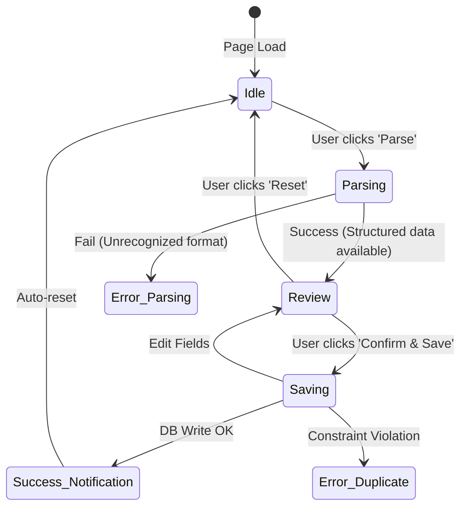

# Paste Slip UX Design

This document outlines the workflow, components, and state machine for the "Paste Slip" ingestion feature.

## 1. Component Map

### `PasteSlipContainer`
- **Purpose**: Manages the high-level state machine.
- **Children**: `InferenceForm`, `ReviewPanel`, `SaveAction`.

### `InferenceForm`
- **Dropdown (Sportsbook)**: Defaults to Most Recent or Smart-Detected.
- **Dropdown (Bankroll Account)**: Defaults to 'Main'.
- **Textarea**: Auto-focused, large touch-target.
- **Button (Parse)**: Primary action.

### `ReviewPanel`
- **Fields Grid**: Structured display of Event, Market, Selection, Line, Price, Stake, Payout, Date.
- **Visual Confidence**: 
    - 🟢 High Confidence (All fields present).
    - 🟡 Partial Match (Missing non-critical fields e.g., Date).
    - 🔴 Incomplete (Missing critical fields e.g., Stake, Line).
- **Duplicate Badge**: Visual warning if `near-duplicate` match is found in DB.

## 2. State Machine

## 3. Error Handling & Guardrails

| Error State | User feedback | Resolution Path |
| :--- | :--- | :--- |
| **Parse Fail** | "We couldn't read this slip. Is it from DraftKings or FanDuel?" | Verify Sportsbook selection; check source text. |
| **Ambiguity** | Yellow highlight on missing/suspect field. | Allow inline editing of the Field Grid. |
| **Duplicates** | ⚠️ "This looks like a duplicate. Did you already upload this?" | Primary Button changes to 'Save Anyway' (secondary action). |
| **DB Timeout** | "Server busy. Your slip is saved locally, click to retry." | Exponential backoff retry in background. |

## 4. UX Copy & Guardrails

- **Empty Textarea**: "Paste your DraftKings or FanDuel slip here to log it..."
- **After Parse**: "Check the details below. We've matched this to [Event Name]."
- **Missing Stake**: ⚠️ "We missed the stake. Please enter it manually."
- **Confirmation**: "Successfully added to [Account Name]!"

## 5. Acceptance Criteria

- [ ] Selecting a Sportsbook adjusts the parser logic on the backend.
- [ ] Pasting text triggers a debounce check for duplicates.
- [ ] A valid slip must show all 8 critical fields before 'Confirm' is enabled.
- [ ] 'Possible Duplicate' warning appears if Book + Selection + Stake match a record from the same day.
- [ ] Clicking 'Save' takes <500ms for optimistic feedback.
